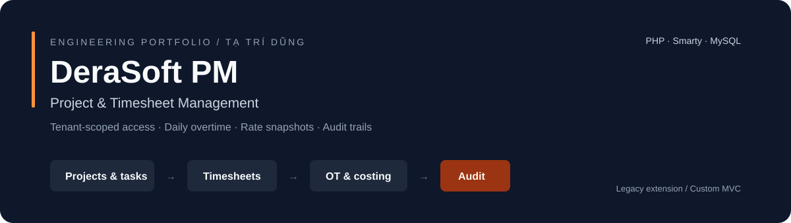

<p align="center">
  
</p>

<p align="center">
  
  
  
  
</p>

# DeraSoft PM

**Local update — 06 Oct 2026:** Phase 11 adds scoped task audits, customer/member
roles/task dates, weekly/task statistics, directory XLSX exports and self-hosted
Bootstrap CSS with the existing Inter theme. 44 regression scripts and nine
Phase 9b UI suites passed locally; Phase 11 UAT/deployment remain pending.
See [requirements matrix](docs/PHASE11_REQUIREMENTS.md). Branch
`feature/pm-phase11-requirements` is local and has not been pushed.

**Project & timesheet management built by extending an existing PHP application.**

DeraSoft PM connects workforce management, projects, tasks and time tracking in a tenant-scoped workspace for Admin, Project Manager, HR and employees. It preserves the existing DeraSoft architecture while adding prepared queries, access boundaries and auditable business operations.

**Author:** [Tạ Trí Dũng](https://github.com/tridung-ta) · **Focus:** backend development, business rules and legacy integration.

> **Development status — 04 Oct 2026:** Phases 6–9 are built and automated-verified locally on `feature/pm-phase9-ui-security`; local commits are prepared per phase. These changes are not pushed. The latest published implementation remains [Phase 5](https://github.com/tridung-ta/derasoft-pm/tree/feature/pm-phase5-timesheet-ot). Final user UAT and production acceptance remain pending.

## What the application does

| Area | Implemented on the Phase 5 branch |
| --- | --- |
| Authentication & access | Legacy password upgrade, secure sessions, four roles and tenant-scoped permissions |
| Workforce | User and department management, multiple roles and effective hourly rates |
| Projects & tasks | Project members, task assignment, priorities, deadlines and four-column Kanban |
| Timesheets | Task/date/shift entries, a 24-hour daily limit and recalculation after changes |
| Overtime & costing | Daily OT across projects, stored rate snapshots and MySQL DECIMAL cost calculation |
| Automatic locking | Three calendar days to edit; Admin corrections after locking receive separate audit actions |
| Audit viewer | Tenant/project/department access scopes, financial-field redaction, filters and pagination |

Timesheet approval is intentionally deferred. Phase 5 has no Submitted/Approved/Rejected workflow. Reports/XLSX and personnel import are locally implemented.

**Locally verified Phase 6:** cost dashboard with stored actual costs, DECIMAL estimates, mixed-currency warnings (no invalid totals), Admin/PM project scopes, pinned local Chart.js and polling every 60 seconds while the tab is visible. Service, HTTP, template and synthetic-browser acceptance passed.

**Locally verified Phase 7:** weekly allocations, time-bound daily/weekly capacity overrides, half-open interval overlap warnings, scoped workload totals and capacity suggestions. Allocation/audit writes are transactional; sorted user/day mutexes were exercised with two MySQL connections. Suggestions never change assignments automatically. Service, HTTP, template and synthetic-browser checks passed; user UAT and publication remain pending.

## Engineering highlights

- **Tenant isolation:** new business queries and access checks use the session's `store_id`.
- **Consistent daily OT:** a unique user/day ledger is locked before writes; editing, moving or hiding an entry recalculates the affected days.
- **Historical costing:** each timesheet stores its rate snapshot and cost; editing the same date preserves the original rate.
- **Auditable transactions:** the business write, affected-row recalculation and JSON audit records commit or roll back together.
- **Safe legacy extension:** additive migrations, soft deletes and compatibility paths preserve existing functionality.
- **Server-side enforcement:** ownership, role permissions, CSRF checks and the edit window accompany escaped Smarty output.

## Architecture

```text
modules/admin/         Controllers and permission / CSRF checks
classes/dao/           Prepared data access for new PM modules
classes/services/      Business rules, transactions, OT and rate resolution
templates/admin/       Smarty views
database/migrations/   Versioned additive schema changes
database/seeds/        Role and permission mappings
tests/                 Local service and template smoke checks
docs/                  Audit, plans, schema and verification records
```

**Stack:** plain PHP · Smarty · MySQL/InnoDB · custom MVC · embedded PhpSpreadsheet.

## Explore the work

- [Latest implementation](https://github.com/tridung-ta/derasoft-pm/tree/feature/pm-phase5-timesheet-ot)
- [Progress and commands actually run](https://github.com/tridung-ta/derasoft-pm/blob/feature/pm-phase5-timesheet-ot/docs/PROGRESS.md)
- [Phase 5 scope and business rules](https://github.com/tridung-ta/derasoft-pm/blob/feature/pm-phase5-timesheet-ot/docs/PHASE5_PLAN.md)
- [Architecture and security audit](https://github.com/tridung-ta/derasoft-pm/blob/feature/pm-phase5-timesheet-ot/docs/AUDIT.md)
- [Database schema](https://github.com/tridung-ta/derasoft-pm/blob/feature/pm-phase5-timesheet-ot/docs/DB_SCHEMA.md)
- [Portfolio / CV summary](docs/PORTFOLIO.md)

## Local verification

Use PHP 8.3 with the required extensions and a backed-up local database. See the [environment baseline](https://github.com/tridung-ta/derasoft-pm/blob/feature/pm-phase5-timesheet-ot/docs/BASELINE.md) and [migration conventions](database/migrations/README.md) before setup. Environment configuration and license files are supplied separately; the public repository is not a one-command installation package.

After checking out the implementation branch and preparing the local schema, representative checks are:

```sh
php tests/pm_timesheets_smoke.php
php tests/pm_timesheet_window_smoke.php
php tests/pm_audit_smoke.php
php tests/smoke_pm_timesheets.php
php tests/smoke_pm_audit.php
```

These checks passed on the documented local environment. Database smoke fixtures use transactions and rollback. Automated service/template verification does not replace browser UAT or concurrent multi-connection testing.

## Roadmap

| Phase | Status |
| --- | --- |
| 0–2 · Audit, local baseline, auth & RBAC | Documented and verified |
| 3–5 · Workforce, projects, timesheets & audit | BUILD / automated verification completed; UAT pending |
| 6 · Cost aggregation & charts | Locally built / automated verified; not yet published, UAT pending |
| 7 · Resource allocation & overbooking | Locally built / automated verification completed; unpublished, UAT pending |
| 8 · Reports & Excel | Reports/XLSX and resumable personnel import locally built / automated verified; unpublished, UAT pending |
| 9 · UI/accessibility, query and security hardening | Locally built / automated verified; coverage limits documented, UAT pending |
| Release acceptance | Pending UAT and explicit deployment approval |

## Tiếng Việt

Hệ thống quản lý dự án và chấm công phát triển trên nền DeraSoft hiện có, không viết lại framework. Điểm chính gồm phân quyền theo tenant, quản lý nhân sự/dự án/task, tính OT theo tổng giờ ngày, snapshot đơn giá và audit log trong transaction. Chấm công được sửa/xóa trong ba ngày lịch tính từ ngày làm việc; Admin sửa sau khóa có audit riêng.

Mã đã công bố mới nhất nằm trên nhánh Phase 5 được dẫn ở trên. Phase 6–9 đã BUILD và kiểm thử local, có checkpoint commit local theo phase, chưa push/merge; UAT và production chưa xác nhận. Các file cấu hình bảo mật, license riêng của ứng dụng, dữ liệu upload, database dump, cache và log không được đưa vào Git.

Local Phase 8 import supports Admin-only XLSX preview/staging, per-row Apply results,
duplicate-key handling and resume with a connection-owned batch lock. The approved tenant
email UNIQUE index preserves the legacy MyISAM engine. New accounts remain inactive until
Admin provisions a password and explicitly activates them. MyISAM writes and PM journal
writes are not one atomic transaction. Successful Apply/crash scenarios use a temporary
transactional user mirror; native duplicate rejection is checked on the actual local table.

Run the current local regression suite with `./tests/pm_regression.ps1` (41 scripts;
requires the documented local DB and PHP setup). This runner does not apply migrations.

Local Phase 9 adds shared accessible navigation/forms/table regions, exact tenant-scoped
batch role lookup (20 role queries → 1), active-session checks, PM login/logout CSRF and
local-only CSP-compatible assets. The 41-script regression suite and synthetic browser
matrix passed. Authenticated HTTP UI coverage is Admin/Employee; PM/HR service fixtures
are distinct from authenticated UI sessions. See [verification and remaining coverage](docs/PHASE9_VERIFY.md).
EXPLAIN of 62 local query shapes is evidence of query/index selection, not a production benchmark.

Phase 10 local BUILD / automated VERIFY is complete: 41 regression scripts, authenticated
four-role browser checks and native MyISAM PHP-worker crash/resume passed on an isolated DB.
Synthetic accounts were disabled and business fixtures soft deleted; source personnel stayed unchanged.
See [verification and remaining coverage](docs/PHASE10_VERIFY.md),
[manual FileZilla deployment preparation](docs/DEPLOY_LOG.md) and
[final local UAT checklist](docs/UAT_FINAL_LOCAL.md). User UAT is pending; no deployment occurred.
